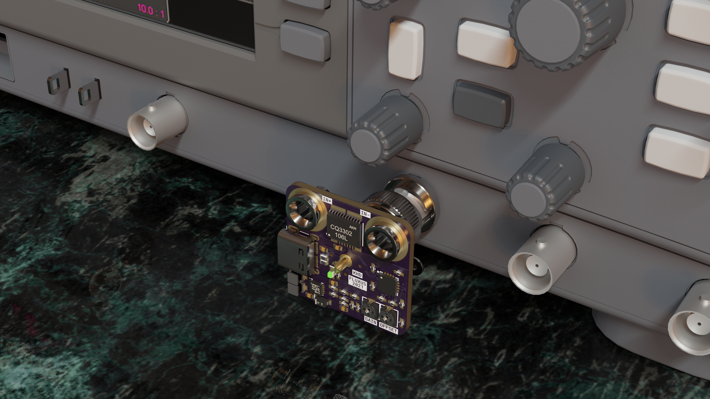

# Fluxus

## Concept
A small direct attach current probe to be used with an oscilloscope.

## Loose Requirements
- Panel mount to oscilloscope
- Powered via USB
- ~+-10A measurement range
- -3dB BW of ~1MHz
- Bipolar current sensing

## Part Choices
- Current Sensor: CQ-3302
- J-FET Opamp : ADA4610
- Split-rail PSU: LT3463
- BNC Connector: 112420

## Renders 

